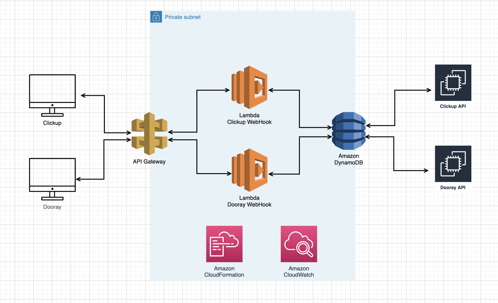

# webhook-issue-relay

## Overview
### Architecture


```
// workflow dooray to clickup
:dooray event(automation) -> webhook(dooray format) -> lambda -> dynamodb -> request to clickup api

// workflow clickup to dooray
: clickup event(automation) -> webhook(clickup format) -> lambda -> dynamodb -> request to dooray api
```

### Functions
/dooray2clickup/sync-task/{두레이 프로젝트 번호}
: 두레이서 작석한 특정 프로젝트의 이슈를 클릭업의 특정 리스트로 동기화

/clickup2dooray/sync-task/{클릭업 리스트번호}
: 클릭업에서 작성한 특정 리스트의 이슈를 두레이 특정 프로젝트로 동기화

/syncTaskJob
: 24시간의 한번 Dooay, Clickup 상태 동기화